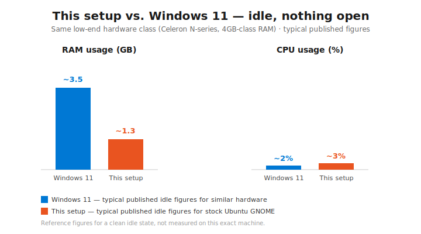

# ubuntu-to-mac-os-package

`./install.sh` into mac easily. Reproduces the macOS-Tahoe-styled Ubuntu/GNOME
desktop setup built up in a Claude Code session. Run once on a fresh Ubuntu
GNOME install:

```
bash install.sh
```

There's also a performance variant for weaker hardware — same theme, wallpapers
and layout, but without the GPU-heavy animated extensions:

```
bash install-performance.sh
```

Then log out and back in — GNOME needs a fresh session to fully activate newly
installed shell extensions.



Both sides are typical published idle-state figures for similar low-end
hardware, not measured on this exact machine — treat as illustrative.

## Normal vs. performance

Both variants now use plain `dash-to-dock@micxgx.gmail.com` — dash2dock-lite
(a floating, custom-compositing dock) was dropped entirely after its
"compatibility hack" for hooking into the magic-lamp minimize effect turned
out to be the source of several hard-to-diagnose bugs (crashes on this GNOME
version, click-blocking, misaligned/misdirected minimize animations) that
plain dash-to-dock doesn't have, since the magic-lamp effect's own built-in
icon-detection logic was written against it in the first place.

`install.sh` is the uncompromised version — every remaining animated
extension: compiz-windows-effect, desktop-cube, compiz-alike-magic-lamp-effect,
and blur-my-shell.

`install-performance.sh` drops all of those via
`scripts/03-extensions-performance.sh`, tuned against real hardware (an
Intel Celeron N5100, 3.3GB RAM, integrated graphics) where `gnome-shell`
alone idled at ~55-60% of one core even with just the lighter first-pass cuts.
blur-my-shell in particular is a continuous compositor cost, not a one-off
animation like the other two — it recomputes on every panel/dock/overview
redraw, so "only animates during its own transition" doesn't apply to it the
way it does to desktop-cube or the magic-lamp effect.

`dconf/org-gnome-shell-performance.ini` started as a capture of the
configuration actually running and confirmed working well on the original
dev machine (via `dconf dump`), then had blur-my-shell, desktop-cube, and
compiz-alike-magic-lamp-effect stripped out entirely for the reasons above.

## What's included

- `scripts/00-zram.sh` — installs `systemd-zram-generator` and configures a
  compressed RAM-backed swap device (half of RAM, capped at 4G, zstd,
  checked before disk swap). Unrelated to the theme, but worth having on
  RAM-constrained hardware — disk swap causes real stalls when hit, zram is
  fast enough that hitting it barely registers.
- `scripts/00-trim-autostart.sh` — disables the Evolution reminder-popup
  daemon and the update-notifier tray icon via per-user autostart overrides
  (no system files touched, no sudo, reversible). Also masks
  `gnome-software.service`: it's D-Bus-activated, and PackageKit fires a
  "cache changed" signal after every single `apt-get`/`dpkg` operation, which
  gnome-software responds to by re-resolving its entire app catalog — a
  10+ minute CPU spike on weak hardware. Since this repo's own scripts run
  several `apt-get install` calls back-to-back, that spike would otherwise
  fire repeatedly on every install run, which is why this script runs first,
  before anything else touches apt. Trade-off: the "Software" app icon won't
  open until you run `systemctl --user unmask gnome-software.service`.
- `scripts/01-packages.sh` — apt packages (gnome-sushi for Quick Look-style
  previews, fonts-inter, nodejs/npm, flatpak, gnome-tweaks) and Sober
  (Flathub) for Roblox. Recent Ubuntu releases no longer ship Flatpak
  preinstalled, so `flatpak` and `gnome-software-plugin-flatpak` are
  installed explicitly before the Flathub remote is added.
- `scripts/02-theme.sh` — clones and installs the MacTahoe GTK theme, icon
  theme, and cursors from vinceliuice's official repos (canonical upstream
  source, not a snapshot — this generates variants correctly). Passes
  `-l`/`--libadwaita` so the theme also lands in `~/.config/gtk-4.0` — without
  it, GTK4/libadwaita apps (Settings, Files, Text Editor, ...) ignore
  `~/.themes` entirely and fall back to plain monochrome Adwaita window
  buttons instead of the macOS-style red/yellow/green traffic lights (which
  are real colored PNG assets baked into the theme, not a config toggle).
- `scripts/03-extensions.sh` — installs all GNOME Shell extensions (apt-bundled
  ones + store ones via the official install mechanism) and loads every
  setting that was tuned this session (dock behavior, animations, panel
  layout, notification position, day/night theme switching, etc.) from the
  `dconf/*.ini` dumps. Used by `install.sh`.
- `scripts/03-extensions-performance.sh` — same idea, but skips
  compiz-windows-effect, desktop-cube, compiz-alike-magic-lamp-effect, and
  blur-my-shell entirely, and loads `dconf/org-gnome-shell-performance.ini`
  instead (see above). Used by `install-performance.sh`.
- `scripts/04-launchers.sh` — installs the `~/.local/bin/*.sh` app-launcher
  scripts (Claude/Spotify/Firefox) and fixes `~/.bashrc` so `~/.local/bin` is
  on PATH in ordinary terminal windows, not just login shells.
- `scripts/05-firefox-theme.sh` — installs macFox-theme (Tahoe UI variant)
  into whatever Firefox profile is current, auto-detected (works for both the
  Firefox snap and a regular install).
- `scripts/06-claude-cli.sh` — symlinks the Claude desktop app's bundled CLI
  binary onto PATH. Re-run this specific script (not the whole install) if it
  ever goes stale after the desktop app auto-updates.
- `scripts/07-extension-patches.sh` — overwrites specific files inside four
  extensions with real bug fixes found in use (see "Extension patches"
  below). Full-file replacements, not diffs, since patch context drifts
  across extension versions.
- `scripts/08-uncap-workspaces.sh` — raises GNOME's hard-coded 36-workspace
  ceiling. Needs `sudo` since it edits a system schema file directly.
- `scripts/09-terminal.sh` — installs a custom "Tahoe Night" color palette
  (`config/tahoe-night.palette`, Tokyo-Night-inspired) for the Ptyxis
  terminal and sets it active with a light 90% opacity. Also installs
  `fastfetch` with an Apple-logo splash (`config/fastfetch-config.jsonc`)
  that runs automatically on every new interactive shell via `.bashrc`.

## Extension patches

Real bugs found in third-party extensions during use, fixed by replacing the
affected file outright (see `patches/`):

- **compiz-windows-effect (wobbly windows)** — `vfunc_modify_paint_volume`
  was a stub always returning `false`, so GNOME Shell never expanded the
  window's paintable area to fit the wobble deformation; anything the spring
  physics pushed past the window's original rectangle got clipped. Also
  disables any `Rounded Corners Effect` on the actor for the duration of the
  wobble — a corner-clipping shader and a deformation effect fight each other
  by nature, regardless of which rounded-corners extension is used.
- **compiz-alike-magic-lamp-effect (minimize animation)** — `toTheBorder` was
  hardcoded `true`, forcing the animation to always fly to the literal
  monitor edge once it detected the icon was near a screen border, even when
  the dock was fully visible partway up from that edge. Set to `false`.
- **desktop-cube** — its own preferences window had no way to control
  workspace count at all, despite the cube requiring a fixed count to render
  correctly. Added a "Workspaces" group (dynamic-workspaces toggle + a
  fixed-count spinner bound directly to the real system settings) to its
  prefs page.

## Keybindings set up

- `Super+Shift+C` → Claude desktop app
- `Super+Shift+S` → Spotify
- `Super+Shift+F` → Firefox

## Not included on purpose

- Anything from `~/Downloads` or other personal files/documents — this only
  covers system configuration, not your data.
- The disk-cleanup work from earlier in the session (deleting old Timeshift
  snapshots, moving Downloads to external storage) — that was one-time
  cleanup specific to a full disk, not general setup worth replaying blindly
  on a fresh machine with different free space.
- The Windows-side `tracker-dashboard` project import — unrelated to desktop
  theming, and already lives at `~/tracker-dashboard`.
- Liquid Glass shell extension — tried it, you didn't like it, removed.
- Rounded Window Corners Reborn — removed after it turned out to fundamentally
  conflict with the wobbly-windows effect (see "Extension patches").
- dash2dock-lite — removed after its dash2dock-lite-specific hook into the
  magic-lamp minimize effect proved to be a source of several serious,
  hard-to-diagnose bugs (a crash on this GNOME version's `addChrome()` API,
  invisible-widget click-blocking, misaligned/misdirected minimize
  animations) — see "Normal vs. performance" above. Both variants now use
  plain `dash-to-dock`.
- The logo-menu extension's custom icon was reset to default rather than
  carried over (it was pointing at an offensive image in your Downloads).
- Several extensions present on the live desktop this was packaged from
  (a weather extension, a clipboard manager, CoverflowAltTab, a lockscreen
  clock/customizer, a fan-control applet) — those were added independently,
  are unrelated to "make Ubuntu look like macOS," and this script has no
  install step for them. Add them yourself via the Extensions app if wanted.

## Notes

- `scripts/03-extensions.sh`'s `InstallRemoteExtension` calls may need a
  manual confirmation click the first time, or may need re-running once
  logged in with a full graphical session — GNOME's live extension
  installation flow was flaky in the original session (worked for
  store-installed extensions via this exact method, did not work for a
  manually-placed local extension).
- The MacTahoe theme install script (`scripts/02-theme.sh`) uses the default
  color variant. Run `~/.themes` or the cloned repo's `install.sh --help`
  yourself if you want a different accent color.
- The `dconf/*.ini` files use `__HOME__` as a placeholder anywhere an absolute
  home-directory path is needed (launcher script locations, wallpaper paths).
  `scripts/03-extensions.sh` substitutes it for your real `$HOME` at load
  time, so this works for any user on any machine.
- `scripts/08-uncap-workspaces.sh` edits a file owned by the
  `gsettings-desktop-schemas` package directly (GSettings override files can
  only change defaults, not the allowed `<range>`). Any OS/package update
  that reinstalls that file resets the cap back to 36 — just re-run the
  script if that happens.
